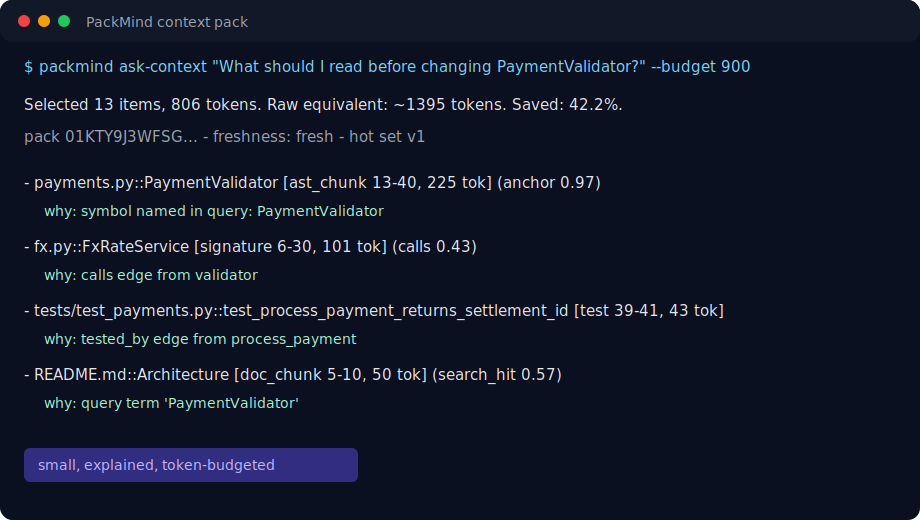
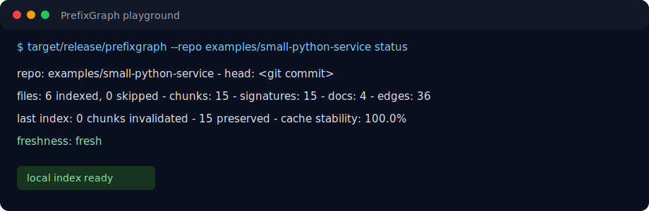
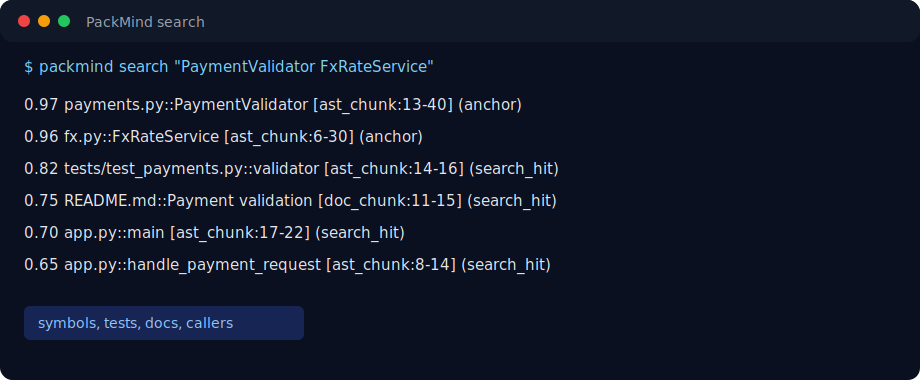

# PackMind Usage Guide

This guide shows the fastest path from a fresh clone to a useful context pack.
It uses the included `examples/small-python-service` playground so you can try
PackMind without risking a real project.

## What You Get

PackMind turns a repository into an indexed local graph and returns focused
context for a task:



The important part is not just the selected files. Every item includes a
reason: `anchor`, `search_hit`, `calls`, `tested_by`, `doc_mention`, and so on.

## Install From Source

Prerequisites:

- Rust toolchain with `cargo`
- Git

Build:

```sh
cargo build --release
```

Binary:

```sh
target/release/packmind --help
```

## Run The Playground

The quickest demo is:

```sh
scripts/playground.sh
```

That script:

1. builds the release binary if needed;
2. initializes the example repo;
3. indexes the example repo;
4. runs `status`, `search`, `tests`, `impact`, and `ask-context`.

The playground writes local state to:

```text
examples/small-python-service/.packmind/
```

That directory is ignored by Git.

## Manual Quick Start

Use any repository path:

```sh
target/release/packmind init /path/to/repo
target/release/packmind --repo /path/to/repo index --force
target/release/packmind --repo /path/to/repo status
```

On the included playground:



Search the graph:

```sh
target/release/packmind --repo examples/small-python-service \
  search "PaymentValidator FxRateService"
```



Build a context pack:

```sh
target/release/packmind --repo examples/small-python-service \
  ask-context "What should I read before changing PaymentValidator?" \
  --budget 900
```

Render exact prompt text:

```sh
target/release/packmind --repo examples/small-python-service \
  pack "Explain the payment flow" \
  --budget 900 \
  --render plain
```

## Common Workflows

### 1. Ask "what should I read?"

```sh
target/release/packmind --repo /path/to/repo ask-context \
  "What should I read before changing PaymentValidator?" \
  --budget 12000
```

Use this before editing shared code. It prints selected files/symbols and the
reason each item was included.

### 2. Get JSON for a custom tool

```sh
target/release/packmind --repo /path/to/repo pack \
  "Refactor auth middleware and update tests" \
  --budget 8000 \
  --json
```

Use this when you want to feed PackMind output into your own script,
dashboard, or agent.

### 3. Render pasteable prompt context

```sh
target/release/packmind --repo /path/to/repo pack \
  "Explain the payment flow" \
  --budget 9000 \
  --render plain
```

Paste the rendered `<pm:ctx ...>` blocks above your question in an LLM chat.

### 4. Find related tests

```sh
target/release/packmind --repo /path/to/repo tests payments.py
target/release/packmind --repo /path/to/repo tests PaymentValidator
```

### 5. Check impact before changing a symbol

```sh
target/release/packmind --repo /path/to/repo impact PaymentValidator --depth 2
```

This follows reverse graph edges and shows callers/tests/related code by
distance.

## Use With MCP Clients

Run:

```sh
target/release/packmind --repo /path/to/repo mcp
```

Example client config:

```json
{
  "mcpServers": {
    "packmind": {
      "command": "/absolute/path/to/packmind",
      "args": ["--repo", "/absolute/path/to/repo", "mcp"]
    }
  }
}
```

Available read-only tools:

- `search_code`
- `explain_symbol`
- `find_callers`
- `find_tests`
- `build_context_pack`
- `changed_since`
- `impact_analysis`
- `get_content`

Suggested first prompt for your MCP agent:

```text
Use PackMind build_context_pack for this task before reading individual
files: explain the payment flow and identify the tests I should update.
```

## Recommended Budgets

| Task | Suggested budget |
| --- | ---: |
| Quick orientation | 2,000-4,000 tokens |
| Normal feature/change task | 6,000-12,000 tokens |
| Large refactor planning | 12,000-24,000 tokens |

If a pack is too broad, add anchors such as a file path or symbol name:

```sh
target/release/packmind --repo /path/to/repo pack \
  "Change payments.py PaymentValidator to enforce a new limit" \
  --budget 6000
```

## Reading Pack Output

Example line:

```text
- payments.py::PaymentValidator [ast_chunk 13-40, 225 tok] (anchor 0.97)
    why: symbol named in query: PaymentValidator
```

Meaning:

- `payments.py::PaymentValidator` is the selected code item.
- `ast_chunk` means a tree-sitter declaration chunk.
- `13-40` is the line range.
- `225 tok` is the token count.
- `anchor` means the query explicitly named it.
- `0.97` is the planner score.

## Keep The Index Fresh

Check freshness:

```sh
target/release/packmind --repo /path/to/repo status
```

Re-index after edits:

```sh
target/release/packmind --repo /path/to/repo index
```

Use `--force` when you want a clean rebuild:

```sh
target/release/packmind --repo /path/to/repo index --force
```

## Reproduce The Public Eval

Run the 20-repo benchmark:

```sh
scripts/eval_github_repos.py
```

Verify a result:

```sh
scripts/verify_github_eval.py eval/results/packmind_20_20260612T174255Z
```

The checked-in clean run is documented in:

```text
eval/results/packmind_20_20260612T174255Z/report.md
eval/results/packmind_20_20260612T174255Z/provenance.md
```

